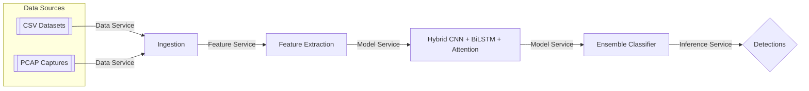

### Encrypted IDS Project Roadmap

This roadmap consolidates architecture and flow per `1.md` with microservices and two dataset modes (CSV and PCAP).

#### High-Level Data Flow

#### Execution Pipeline

1. Data Service
   - CSV: read via `csv_loader.py`
   - PCAP: convert to flows via CICFlowMeter wrapper in `pcap_loader.py`
2. Feature Service
   - Standard features + novel invariance features and TLS entropy
3. Model Service
   - `HybridCNNBiLSTMAttention` for representation
   - Adversarial training (FGSM baseline) for robustness
   - Ensemble classifier for final decision
4. Inference Service
   - Real-time scoring and API exposure

#### Notebooks

- 01_CSV_Ingestion_and_Cleaning
- 02_PCAP_to_Flows_and_Processing
- 03_Feature_Engineering_Attention
- 04_Model_Training_CNN_BiLSTM_Attention
- 05_Adversarial_Training_and_Evaluation
- 06_Ensemble_Evaluation_and_ZeroDay

#### Environments and Requirements

- APIs: FastAPI + Uvicorn
- ML: PyTorch, scikit-learn, pandas, numpy
- PCAP: CICFlowMeter (external), optional pyshark/scapy
