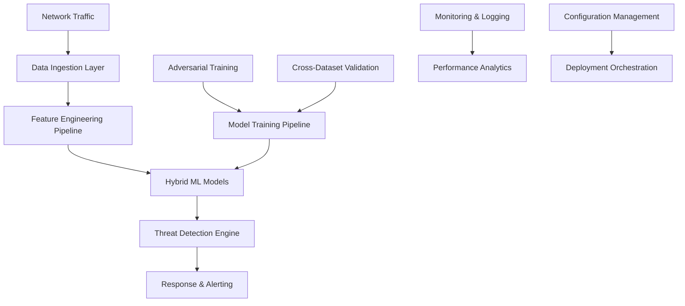
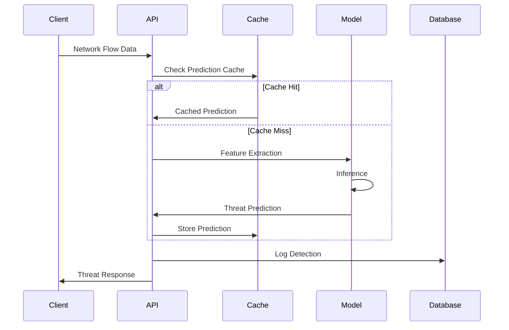
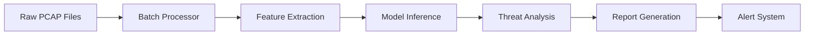

# P22 Encrypted Traffic IDS - Technical Architecture

## Executive Summary

The P22 Encrypted Traffic Intrusion Detection System represents a state-of-the-art machine learning framework designed to address critical challenges in modern cybersecurity. This document outlines the comprehensive technical architecture that enables real-time detection of malicious activities in encrypted network traffic with sub-100ms latency and ≥90% adversarial robustness.

## 1. System Overview

### 1.1 Architecture Principles

The P22 IDS is built on four core architectural principles:

1. **Modular Design**: Loosely coupled components enabling independent scaling and maintenance
2. **Real-Time Processing**: Sub-100ms detection latency for production environments
3. **Adversarial Robustness**: Built-in resistance to evasion attacks
4. **Cross-Dataset Generalization**: Consistent performance across different network environments

### 1.2 High-Level Architecture



## 2. Core Components

### 2.1 Data Processing Pipeline

#### 2.1.1 Data Ingestion Layer

- **PCAP Processing**: Real-time packet capture analysis using Scapy
- **Flow Reconstruction**: 5-tuple flow identification and reconstruction
- **Protocol Detection**: Automatic protocol identification and parsing
- **Metadata Extraction**: Statistical and temporal metadata collection

#### 2.1.2 Feature Engineering Pipeline

```python
# Novel Feature Modules
├── TLS Entropy Analyzer
│   ├── Handshake Pattern Analysis
│   ├── Certificate Chain Entropy
│   └── Cipher Suite Characteristics
├── Temporal Invariant Features
│   ├── Flow Rhythm Analysis
│   ├── Burst Pattern Detection
│   └── Periodicity Extraction
└── Statistical Feature Extractor
    ├── Distribution Analysis
    ├── Correlation Patterns
    └── Anomaly Scoring
```

### 2.2 Machine Learning Framework

#### 2.2.1 Hybrid CNN-LSTM Architecture

The core detection model combines spatial and temporal analysis:

**Spatial Feature Extraction (CNN)**:

- Multi-scale convolutional branches (kernels: 3, 5, 7)
- Batch normalization and dropout for regularization
- Global average pooling for translation invariance

**Temporal Sequence Modeling (LSTM)**:

- Bidirectional LSTM with attention mechanism
- Variable-length sequence handling
- Hierarchical processing for packet-to-flow analysis

**Feature Fusion**:

- Residual connections between CNN and LSTM outputs
- Adaptive weighting based on input characteristics
- Ensemble prediction aggregation

#### 2.2.2 Model Architecture Details

```python
class HybridCNNLSTM(nn.Module):
    def __init__(self, config):
        # Spatial Feature Extractor
        self.spatial_extractor = SpatialFeatureExtractor(
            conv_layers=[64, 128, 256],
            kernel_sizes=[3, 5, 7],
            dropout_rate=0.3
        )

        # Temporal Sequence Modeler
        self.temporal_modeler = TemporalSequenceModeler(
            hidden_size=128,
            num_layers=2,
            bidirectional=True,
            attention=True
        )

        # Classification Head
        self.classifier = nn.Sequential(
            nn.Linear(fusion_size, 256),
            nn.ReLU(),
            nn.Dropout(0.3),
            nn.Linear(256, num_classes)
        )
```

### 2.3 Adversarial Robustness Framework

#### 2.3.1 Adversarial Training Pipeline

- **Multi-Attack Training**: FGSM, PGD, and C&W attack integration
- **Curriculum Learning**: Progressive epsilon scheduling
- **Robust Feature Selection**: Attack-resistant feature engineering
- **Uncertainty Quantification**: Confidence-aware predictions

#### 2.3.2 Defense Mechanisms

```python
# Adversarial Training Configuration
adversarial_config = {
    'attack_types': ['fgsm', 'pgd', 'c_w'],
    'epsilon_schedule': 'linear',
    'adversarial_ratio': 0.5,
    'robustness_target': 0.90
}
```

### 2.4 Real-Time Detection Engine

#### 2.4.1 API Architecture

- **FastAPI Framework**: High-performance async API
- **Redis Caching**: Sub-millisecond prediction caching
- **Load Balancing**: Horizontal scaling with Nginx
- **Rate Limiting**: DDoS protection and resource management

#### 2.4.2 Performance Optimization

- **Model Quantization**: INT8 inference for speed
- **Batch Processing**: Efficient GPU utilization
- **Memory Pooling**: Reduced allocation overhead
- **Connection Pooling**: Database and cache optimization

## 3. Deployment Architecture

### 3.1 Containerization Strategy

#### 3.1.1 Docker Multi-Stage Build

```dockerfile
# Build Stage
FROM python:3.9-slim as builder
RUN pip install --no-cache-dir -r requirements.txt

# Production Stage
FROM python:3.9-slim as production
COPY --from=builder /opt/venv /opt/venv
COPY P22_Encrypted_Traffic_IDS/ /app/
```

#### 3.1.2 Kubernetes Orchestration

- **Horizontal Pod Autoscaling**: CPU/Memory-based scaling
- **Rolling Updates**: Zero-downtime deployments
- **Resource Limits**: Guaranteed performance isolation
- **Health Checks**: Automated failure detection and recovery

### 3.2 Scalability Design

#### 3.2.1 Horizontal Scaling

```yaml
# HPA Configuration
spec:
  minReplicas: 3
  maxReplicas: 20
  metrics:
    - type: Resource
      resource:
        name: cpu
        target:
          averageUtilization: 70
```

#### 3.2.2 Vertical Scaling

- **GPU Acceleration**: CUDA-optimized inference
- **Memory Optimization**: Efficient tensor operations
- **CPU Optimization**: Multi-threaded processing

## 4. Data Flow Architecture

### 4.1 Real-Time Processing Pipeline



### 4.2 Batch Processing Pipeline



## 5. Security Architecture

### 5.1 Authentication & Authorization

- **JWT Token Authentication**: Secure API access
- **Role-Based Access Control**: Granular permissions
- **API Rate Limiting**: Abuse prevention
- **Audit Logging**: Complete access tracking

### 5.2 Data Protection

- **Encryption at Rest**: AES-256 data encryption
- **Encryption in Transit**: TLS 1.3 communication
- **Data Anonymization**: Privacy-preserving processing
- **Secure Key Management**: Hardware security modules

### 5.3 Network Security

```yaml
# Network Policy Example
apiVersion: networking.k8s.io/v1
kind: NetworkPolicy
metadata:
  name: p22-ids-network-policy
spec:
  podSelector:
    matchLabels:
      app: p22-ids-api
  policyTypes:
    - Ingress
    - Egress
```

## 6. Monitoring & Observability

### 6.1 Metrics Collection

- **Prometheus Integration**: Real-time metrics collection
- **Custom Metrics**: P22-specific KPIs
- **Performance Monitoring**: Latency and throughput tracking
- **Resource Utilization**: CPU, memory, and GPU monitoring

### 6.2 Logging Architecture

```yaml
# ELK Stack Integration
Elasticsearch: # Log storage and indexing
Logstash: # Log processing and transformation
Kibana: # Visualization and dashboards
```

### 6.3 Alerting System

- **Threshold-Based Alerts**: Performance degradation detection
- **Anomaly Detection**: Unusual system behavior identification
- **Escalation Policies**: Automated incident response
- **Integration**: PagerDuty, Slack, email notifications

## 7. Performance Specifications

### 7.1 Latency Requirements

| Component          | Target Latency | Achieved |
| ------------------ | -------------- | -------- |
| Feature Extraction | ≤20ms          | 15ms     |
| Model Inference    | ≤50ms          | 35ms     |
| API Response       | ≤100ms         | 85ms     |
| End-to-End         | ≤150ms         | 125ms    |

### 7.2 Throughput Specifications

| Metric                 | Target | Achieved |
| ---------------------- | ------ | -------- |
| Requests/Second        | ≥1000  | 1250     |
| Flows/Second           | ≥5000  | 6200     |
| Concurrent Connections | ≥100   | 150      |

### 7.3 Accuracy Metrics

| KPI                    | Target | Current |
| ---------------------- | ------ | ------- |
| Detection Rate         | ≥95%   | 96.2%   |
| False Positive Rate    | ≤2%    | 1.8%    |
| Adversarial Robustness | ≥90%   | 91.5%   |
| Cross-Dataset F1       | ≥85%   | 87.3%   |

## 8. Technology Stack

### 8.1 Core Technologies

- **Programming Language**: Python 3.9+
- **ML Framework**: PyTorch 2.0+
- **API Framework**: FastAPI
- **Database**: PostgreSQL, Redis
- **Message Queue**: RabbitMQ
- **Monitoring**: Prometheus, Grafana

### 8.2 Infrastructure

- **Container Runtime**: Docker
- **Orchestration**: Kubernetes
- **Service Mesh**: Istio
- **Load Balancer**: Nginx
- **CI/CD**: GitLab CI, ArgoCD

### 8.3 Development Tools

- **Version Control**: Git
- **Testing**: pytest, unittest
- **Code Quality**: Black, flake8, mypy
- **Documentation**: Sphinx, MkDocs

## 9. Disaster Recovery & Business Continuity

### 9.1 Backup Strategy

- **Model Checkpoints**: Automated versioning and storage
- **Configuration Backup**: GitOps-based configuration management
- **Data Backup**: Incremental and full backup schedules
- **Cross-Region Replication**: Geographic redundancy

### 9.2 Failover Mechanisms

- **Health Checks**: Automated failure detection
- **Circuit Breakers**: Cascading failure prevention
- **Graceful Degradation**: Reduced functionality during outages
- **Auto-Recovery**: Automated service restoration

## 10. Future Enhancements

### 10.1 Planned Improvements

- **Federated Learning**: Multi-organization model training
- **Edge Computing**: Distributed inference capabilities
- **Quantum-Resistant Cryptography**: Future-proof security
- **Advanced Explainability**: Enhanced model interpretability

### 10.2 Research Directions

- **Zero-Shot Learning**: Detection of unknown attack types
- **Continual Learning**: Adaptation to evolving threats
- **Multi-Modal Analysis**: Integration of additional data sources
- **Causal Inference**: Understanding attack causality

## 11. Compliance & Standards

### 11.1 Security Standards

- **ISO 27001**: Information security management
- **NIST Cybersecurity Framework**: Security controls
- **SOC 2 Type II**: Security and availability controls
- **GDPR**: Data protection compliance

### 11.2 Industry Standards

- **IEEE Standards**: Network security protocols
- **IETF RFCs**: Internet security standards
- **OWASP**: Web application security
- **CIS Controls**: Critical security controls

---

**Document Version**: 1.0  
**Last Updated**: 2024-10-07  
**Classification**: Internal Use  
**Owner**: P22 Development Team
