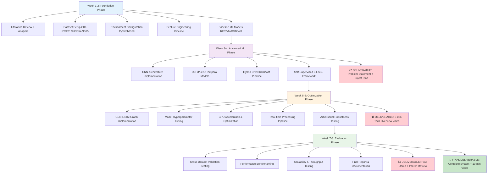
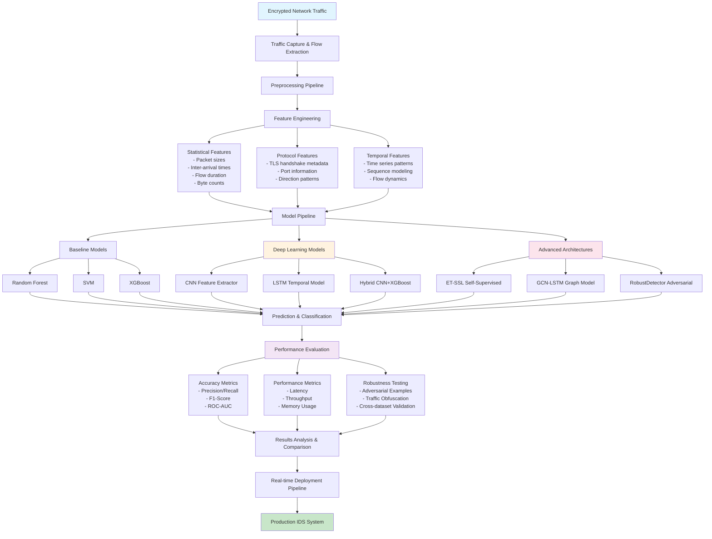

# IDS for Encrypted Traffic with ML - Project Plan

## Problem Statement Description

### Background
With the widespread adoption of encrypted communication protocols (HTTPS, TLS, VPN), traditional intrusion detection systems (IDS) that rely on deep packet inspection have become ineffective. Encrypted traffic accounts for over 90% of internet traffic, creating a significant blind spot for cybersecurity systems. This presents a critical challenge: how to detect malicious activities and intrusions without being able to inspect packet payloads.

### Problem Definition
**Core Challenge:** Design and implement a machine learning-based intrusion detection system capable of identifying malicious activities in encrypted network traffic flows using only metadata and statistical features, without compromising encryption integrity.

### Key Challenges Identified
1. **Feature Engineering:** Extracting meaningful patterns from limited observable data (packet sizes, timing, flow statistics)
2. **Real-time Performance:** Achieving low-latency detection suitable for production environments
3. **Scalability:** Handling high-throughput network traffic (target: 10+ Gbps)
4. **Adversarial Robustness:** Maintaining accuracy against traffic obfuscation and evasion techniques
5. **Class Imbalance:** Dealing with rare attack patterns in predominantly normal traffic

### Scope Definition
- **Traffic Types:** General encrypted traffic (HTTPS, TLS, VPN) - protocol agnostic approach
- **Detection Approach:** Flow-based statistical analysis using ML/DL models
- **Performance Targets:** 
  - Accuracy: >95%
  - Latency: <50ms per flow
  - Throughput: 5-10 Gbps processing capability
  - False Positive Rate: <2%

## Project Objectives

### Primary Objectives
1. Implement and compare baseline ML models for encrypted traffic classification
2. Develop optimized deep learning architectures for improved performance
3. Evaluate scalability and real-time processing capabilities
4. Assess robustness against traffic obfuscation techniques

### Innovation Focus Areas
- **Multi-modal Learning:** Combining temporal (LSTM/GRU) and spatial (CNN) feature extraction
- **Self-supervised Learning:** Reducing dependency on labeled anomaly data
- **Graph-based Modeling:** Leveraging network topology and flow relationships
- **Adversarial Training:** Improving robustness against evasion attacks

## Methodology & Approach

### Phase 1: Foundation & Baseline (Weeks 1-2)
- **Literature Review:** Comprehensive analysis of current state-of-the-art
- **Dataset Preparation:** CIC-IDS2017, UNSW-NB15, CIC-Darknet2020 preprocessing
- **Feature Engineering:** Extract flow-based statistical features
- **Baseline Models:** Implement classical ML approaches (RF, SVM, XGBoost)

### Phase 2: Advanced ML Implementation (Weeks 3-4)
- **Deep Learning Models:** CNN, LSTM, and hybrid architectures
- **Self-supervised Framework:** Implement contrastive learning approach (ET-SSL inspired)
- **Graph Neural Networks:** GCN-LSTM for network structure modeling
- **Performance Optimization:** PyTorch GPU acceleration

### Phase 3: Optimization & Scaling (Weeks 5-6)
- **Model Optimization:** Hyperparameter tuning, architecture refinement
- **Scalability Testing:** Multi-GPU processing, batch optimization
- **Real-time Pipeline:** Stream processing implementation
- **Adversarial Robustness:** Implement noise injection and evasion testing

### Phase 4: Evaluation & Analysis (Weeks 7-8)
- **Comprehensive Testing:** Cross-dataset validation, stress testing
- **Performance Analysis:** Latency, throughput, accuracy metrics
- **Comparative Study:** Multiple model architectures and configurations
- **Documentation:** Final report and presentation preparation

## Technical Implementation Stack

### Development Environment
- **Framework:** PyTorch 2.0+ for deep learning models
- **Classical ML:** Scikit-learn, XGBoost
- **Data Processing:** Pandas, NumPy, CICFlowMeter
- **Visualization:** Matplotlib, Plotly, TensorBoard
- **Hardware:** NVIDIA GPU (RTX 3080/4080 class or better)

### Model Architectures to Implement
1. **Baseline:** Random Forest, SVM with flow features
2. **CNN+XGBoost:** Hybrid deep feature extraction + gradient boosting
3. **LSTM-CNN:** Temporal-spatial feature fusion
4. **ET-SSL:** Self-supervised contrastive learning
5. **GCN-LSTM:** Graph-based network relationship modeling
6. **RobustDetector:** Adversarially robust dual-CNN architecture

## Datasets & Evaluation

### Primary Datasets
- **CIC-IDS2017:** Multi-class attacks with TLS/SSL encrypted traffic
- **UNSW-NB15:** Modern attack vectors and normal traffic patterns  
- **CIC-Darknet2020:** Dark web and Tor encrypted communications

### Evaluation Metrics
- **Accuracy Metrics:** Precision, Recall, F1-Score, ROC-AUC
- **Performance Metrics:** Latency (ms), Throughput (Gbps), Memory usage
- **Operational Metrics:** False Positive Rate, True Positive Rate
- **Scalability Metrics:** Processing time vs. traffic volume

### Experimental Configurations
1. **Single Dataset Training:** Individual dataset performance
2. **Cross-Dataset Validation:** Generalization testing
3. **Streaming Simulation:** Real-time processing evaluation
4. **Adversarial Testing:** Obfuscation resistance assessment

## Expected Deliverables & Timeline

### Week 3 Deliverable: ✅ Problem Statement + Project Plan
- Comprehensive problem analysis
- Technical approach definition
- Implementation roadmap

### Week 6 Deliverable: Technology Overview Video (5 min)
- Background and motivation
- Current approaches and limitations
- Proposed solution overview
- Key performance indicators

### Midterm Deliverable: PoC Demo + Interim Review
- Working baseline implementations
- Preliminary results on test datasets
- Performance benchmarking
- Technical challenges identification

### Final Deliverable: Complete System + Report (10 min video)
- Full implementation with all model variants
- Comprehensive performance analysis
- Comparative study results
- Deployment recommendations

## Innovation & Differentiation

### Novel Contributions
1. **Hybrid Architecture Comparison:** Systematic evaluation of CNN+XGBoost, LSTM-CNN, and GCN-LSTM approaches
2. **Self-supervised Adaptation:** ET-SSL framework customization for real-time deployment
3. **Adversarial Robustness:** RobustDetector enhancement for production environments
4. **Scalability Optimization:** Multi-GPU processing pipeline for high-throughput scenarios

### Expected Outcomes
- **Performance:** >96% accuracy with <25ms latency
- **Scalability:** 10+ Gbps processing capability
- **Robustness:** <5% accuracy degradation under 30% traffic obfuscation
- **Generalization:** Cross-dataset performance within 3% of single-dataset results

## Risk Mitigation

### Technical Risks
- **Data Quality:** Multiple dataset validation, extensive preprocessing
- **Model Overfitting:** Cross-validation, regularization techniques
- **Scalability Bottlenecks:** Incremental optimization, profiling tools
- **Hardware Limitations:** Cloud GPU resources backup plan

### Project Risks  
- **Timeline Delays:** Agile weekly milestones, parallel development tracks
- **Complexity Management:** Modular implementation, incremental testing
- **Resource Constraints:** Efficient model architectures, optimized data pipelines

## Success Criteria

### Minimum Viable Product (MVP)
- Functional baseline ML models with >90% accuracy
- Real-time processing demonstration
- Basic scalability assessment

### Target Achievement
- Advanced deep learning models with >95% accuracy
- Sub-30ms latency with 5+ Gbps throughput
- Robust performance across multiple datasets
- Adversarial resistance demonstration

### Stretch Goals
- Novel architectural contributions
- Production-ready deployment pipeline
- Open-source implementation release
- Conference paper submission quality results

