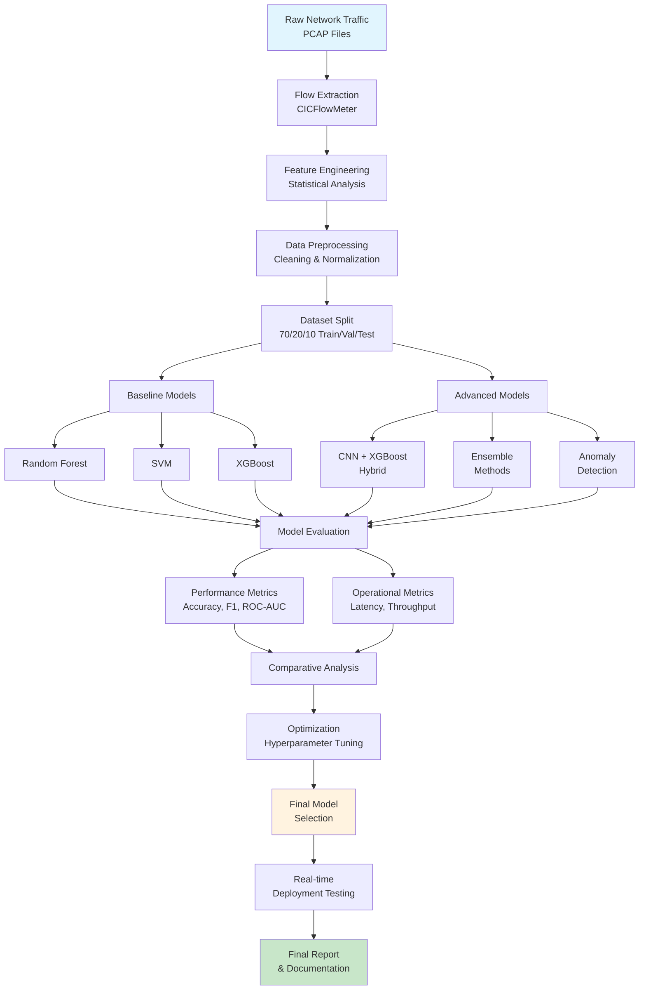

# IDS for Encrypted Traffic with ML - Project Plan

## Problem Statement Description

### Challenge: Intrusion Detection in Encrypted Network Traffic

Modern network security faces a critical challenge: detecting malicious activities in encrypted traffic without compromising privacy. With over 95% of web traffic now encrypted (HTTPS/TLS), traditional payload-based intrusion detection systems (IDS) become ineffective as they cannot inspect packet contents. This creates a significant blind spot in cybersecurity infrastructure.

### Core Problem

- **Payload Invisibility**: Encryption renders traditional signature-based detection useless
- **Feature Limitation**: Must rely solely on flow metadata and statistical patterns
- **Real-time Requirements**: Need low-latency detection for production environments
- **Scalability Demands**: Handle high-throughput network traffic (10+ Gbps)
- **Accuracy vs. Privacy**: Maintain detection effectiveness without decryption

### Research Gap

While recent literature shows promising results with machine learning approaches (ET-SSL achieving 96.8% accuracy, GCN-LSTM models showing 99%+ accuracy), there's still need for:

1. Comparative analysis of classical ML vs. hybrid approaches
2. Optimization strategies for real-time deployment
3. Robustness against traffic obfuscation techniques
4. Scalable feature extraction methodologies

## 8-Week Project Plan

### **Phase 1: Foundation & Setup (Weeks 1-2)**

#### Week 1: Environment & Data Preparation

- **Day 1-2**: Set up development environment
  - Install Python 3.8+, Scikit-learn, XGBoost, PyTorch
  - Configure Jupyter notebooks and Git repository
- **Day 3-5**: Dataset acquisition and preprocessing
  - Download CIC-IDS2017 and UNSW-NB15 datasets
  - Extract encrypted traffic subsets (HTTPS, TLS flows)
  - Implement data cleaning and preprocessing pipeline
- **Day 6-7**: Feature extraction setup
  - Install and configure CICFlowMeter
  - Develop flow-based feature extraction pipeline

#### Week 2: Baseline Implementation

- **Day 1-3**: Classical ML baseline models
  - Implement Random Forest classifier
  - Implement Support Vector Machine (SVM)
  - Implement XGBoost classifier
- **Day 4-5**: Initial evaluation
  - Train models on CIC-IDS2017 encrypted subset
  - Establish baseline performance metrics
- **Day 6-7**: Documentation and analysis
  - Document baseline results
  - Identify performance bottlenecks

### **Phase 2: Advanced Development (Weeks 3-4)**

#### Week 3: Feature Engineering & Optimization

- **Day 1-3**: Advanced feature engineering
  - Develop statistical flow features (timing, size distributions)
  - Implement dimensionality reduction (PCA, feature selection)
  - Create feature importance analysis
- **Day 4-5**: Model optimization
  - Hyperparameter tuning using grid search
  - Cross-validation implementation
- **Day 6-7**: **DELIVERABLE**: Problem statement + project plan submission

#### Week 4: Hybrid Model Development

- **Day 1-4**: CNN+XGBoost hybrid implementation
  - Design CNN architecture for feature learning
  - Integrate CNN features with XGBoost classifier
  - Train and validate hybrid model
- **Day 5-7**: Ensemble methods
  - Implement voting classifiers
  - Develop stacking ensemble approach
  - Compare ensemble vs. individual model performance

### **Phase 3: Advanced Techniques (Weeks 5-6)**

#### Week 5: Semi-supervised & Anomaly Detection

- **Day 1-3**: Self-supervised learning
  - Implement anomaly detection using One-Class SVM
  - Develop Isolation Forest approach
  - Create statistical outlier detection
- **Day 4-5**: Semi-supervised methods
  - Implement label propagation techniques
  - Develop active learning strategies
- **Day 6-7**: **DELIVERABLE**: 5-min technology overview video

#### Week 6: Real-time Processing & Scaling

- **Day 1-3**: Performance optimization
  - Implement batch processing for large datasets
  - Develop parallel processing capabilities
  - Memory optimization and streaming processing
- **Day 4-5**: **DELIVERABLE**: PoC/simulation demo preparation
- **Day 6-7**: Interim review and analysis

### **Phase 4: Evaluation & Finalization (Weeks 7-8)**

#### Week 7: Comprehensive Evaluation

- **Day 1-3**: Multi-dataset evaluation
  - Test on UNSW-NB15 dataset
  - Cross-dataset validation
  - Robustness testing with noise injection
- **Day 4-5**: Performance analysis
  - Latency and throughput benchmarking
  - Communication vs. compute breakdown
  - Scaling behavior analysis
- **Day 6-7**: Results compilation and analysis

#### Week 8: Final Documentation

- **Day 1-4**: Final report preparation
  - Comprehensive experimental results
  - Comparative analysis across approaches
  - Performance optimization insights
  - Future work recommendations
- **Day 5-7**: **DELIVERABLE**: Final report + 10-min findings video

## Technical Approach & Methodology

### 1. Feature Engineering Strategy

**Flow-Based Features (Protocol-Agnostic):**

- **Temporal Features**: Inter-arrival times, flow duration, packet timing statistics
- **Size Features**: Packet length distributions, total bytes, payload size variations
- **Directional Features**: Forward/backward packet ratios, bidirectional flow characteristics
- **Statistical Features**: Mean, variance, skewness, kurtosis of packet sizes and timings
- **Protocol Features**: TLS handshake metadata, connection establishment patterns

### 2. Machine Learning Methodology

**Baseline Classical ML Approaches:**

- **Random Forest**: Ensemble method for handling mixed feature types
- **SVM**: Effective for high-dimensional feature spaces with RBF/linear kernels
- **XGBoost**: Gradient boosting for handling imbalanced datasets

**Advanced Hybrid Approaches:**

- **CNN + XGBoost**: CNN for automated feature learning + XGBoost for classification
- **Ensemble Methods**: Voting classifiers combining multiple algorithms
- **Semi-supervised Learning**: Leveraging unlabeled encrypted traffic data

**Anomaly Detection Techniques:**

- **One-Class SVM**: For novelty detection in encrypted flows
- **Isolation Forest**: Unsupervised anomaly detection
- **Statistical Outlier Detection**: Based on flow feature distributions

### 3. Optimization Strategies

**Performance Optimization:**

- **Feature Selection**: Recursive feature elimination, mutual information
- **Hyperparameter Tuning**: Grid search, random search, Bayesian optimization
- **Model Compression**: Pruning, quantization for real-time deployment

**Scaling Strategies:**

- **Batch Processing**: Mini-batch training for large datasets
- **Parallel Processing**: Multi-threading for feature extraction
- **Memory Optimization**: Efficient data structures, streaming processing

## Datasets, Tools, and Evaluation Metrics

### Datasets

**Primary Datasets:**

- **CIC-IDS2017**: Contains TLS/SSL encrypted traffic, DoS, Botnet, Web attacks
  - Size: ~2.8M flows with labeled normal/attack traffic
  - Encrypted subset: HTTPS, TLS flows for realistic evaluation
- **UNSW-NB15**: Modern network intrusion dataset with encrypted components
  - Size: ~2.5M records with 9 attack categories
  - Features: 49 flow-based features already extracted

**Data Preprocessing:**

- Extract encrypted traffic subsets (HTTPS, TLS, VPN)
- Handle class imbalance using SMOTE/undersampling
- 70/20/10 split for train/validation/test

### Tools & Frameworks

**Machine Learning:**

- **Scikit-learn**: Classical ML algorithms (RF, SVM, ensemble methods)
- **XGBoost**: Gradient boosting implementation
- **PyTorch**: For hybrid CNN+ML approaches and advanced models
- **Pandas/NumPy**: Data manipulation and numerical computing

**Network Analysis:**

- **CICFlowMeter**: Flow feature extraction from PCAP files
- **Scapy**: Packet analysis and custom feature engineering
- **Wireshark/tshark**: Traffic analysis and validation

### Evaluation Metrics

**Classification Performance:**

- **Accuracy**: Overall correctness of predictions
- **Precision/Recall/F1-Score**: Per-class and macro-averaged
- **ROC-AUC**: Area under receiver operating characteristic curve
- **Confusion Matrix**: Detailed classification breakdown

**Operational Metrics:**

- **Latency**: Processing time per flow (target: <25ms)
- **Throughput**: Flows processed per second (target: 10+ Gbps equivalent)
- **Memory Usage**: RAM consumption during processing
- **CPU Utilization**: Computational resource requirements

**Specialized IDS Metrics:**

- **True Positive Rate (TPR)**: Attack detection rate
- **False Positive Rate (FPR)**: False alarm rate (target: <2%)
- **Detection Rate**: Percentage of attacks correctly identified

## Workflow Diagram

## Deliverables Timeline

### **Week 3: Problem Statement + Project Plan** ✅

**Deliverable**: Comprehensive project documentation

- Problem statement description with literature analysis
- Detailed 8-week project plan with phases
- Technical methodology and approach definition
- Dataset, tools, and metrics specification

### **Week 5: Technology Overview Video**

**Deliverable**: 5-minute presentation covering:

- Background on encrypted traffic challenges
- Current IDS approaches and limitations
- Machine learning solutions landscape
- Key performance indicators and success metrics
- Proposed technical approach overview

### **Week 6: PoC Demo + Interim Review**

**Deliverable**: Working prototype demonstration

- Baseline ML models implementation (RF, SVM, XGBoost)
- Feature extraction pipeline from CIC-IDS2017
- Performance benchmarks and initial results
- Hybrid CNN+XGBoost model prototype
- Interim analysis of approach effectiveness

### **Week 8: Final Report + Findings Video**

**Deliverable**: Complete project documentation

- **Final Report** (15-20 pages):

  - Literature review and problem analysis
  - Methodology and implementation details
  - Comprehensive experimental results
  - Comparative analysis across multiple setups
  - Performance optimization insights
  - Scalability and deployment considerations
  - Future work recommendations

- **10-minute Findings Video**:
  - Key research insights and discoveries
  - Performance comparison across different models
  - Real-time processing capabilities demonstration
  - Lessons learned and practical implications
  - Recommendations for production deployment

## Success Criteria

### Technical Targets

- **Accuracy**: >95% on encrypted traffic classification
- **Latency**: <25ms per flow processing time
- **Throughput**: Handle 10+ Gbps equivalent traffic
- **False Positive Rate**: <2% for practical deployment

### Research Contributions

- Comparative analysis of classical vs. hybrid ML approaches
- Feature engineering strategies for encrypted traffic
- Real-time optimization techniques
- Cross-dataset generalization analysis

## Risk Mitigation

### Technical Risks

- **Data Quality Issues**: Validate datasets, implement robust preprocessing
- **Model Overfitting**: Use cross-validation, regularization techniques
- **Performance Bottlenecks**: Profile code, implement parallel processing

### Timeline Risks

- **Scope Creep**: Focus on core objectives, document additional ideas for future work
- **Implementation Delays**: Prioritize baseline models, use existing libraries where possible
- **Hardware Limitations**: Use cloud resources if needed, optimize for available hardware

## Future Work Directions

1. **Deep Learning Extensions**: Implement LSTM/GRU models for temporal sequence analysis
2. **Federated Learning**: Develop privacy-preserving distributed training approaches
3. **Adversarial Robustness**: Test against traffic obfuscation and evasion techniques
4. **Edge Deployment**: Optimize models for IoT and edge computing environments
5. **Real-world Validation**: Test on live network traffic in controlled environments
