# P22 Encrypted Traffic IDS - Complete Execution Flow & Architecture

## 📋 Table of Contents

1. [Project Overview](#project-overview)
2. [Architecture Diagram](#architecture-diagram)
3. [Directory Structure](#directory-structure)
4. [Execution Flow](#execution-flow)
5. [Component Details](#component-details)
6. [Usage Instructions](#usage-instructions)

---

## 🎯 Project Overview

**P22** is an advanced Machine Learning-based Intrusion Detection System (IDS) specifically designed for encrypted network traffic analysis. The system employs hybrid deep learning architectures (CNN + BiLSTM + Attention), ensemble methods, and adversarial training to detect threats in encrypted traffic.

### Key Features

- **Hybrid Deep Learning**: CNN-BiLSTM-Attention architecture for spatial-temporal pattern recognition
- **Ensemble Methods**: Multiple classifier voting for robust detection
- **Adversarial Robustness**: FGSM/PGD-based adversarial training
- **Multi-Format Support**: CSV, PCAP, ARFF, and time-series (NPZ) data formats
- **Microservices Architecture**: Modular design with independent services
- **Real-time Processing**: API-based inference for production deployment

---

## 🏗️ Architecture Diagram

```mermaid
flowchart TB
    subgraph Input["📥 Data Input Layer"]
        CSV[CSV Datasets]
        PCAP[PCAP Files]
        ARFF[ARFF Files]
        TS[Time Series NPZ]
    end

    subgraph Ingestion["🔄 Data Ingestion Service"]
        CSVLoader[CSV Loader]
        PCAPLoader[PCAP Loader<br/>CICFlowMeter]
        ARFFLoader[ARFF Loader]
        TSLoader[Time Series Loader]
    end

    subgraph Preprocessing["⚙️ Preprocessing Pipeline"]
        Clean[Data Cleaning]
        Normalize[Normalization]
        Encode[Encoding]
        Split[Train/Val/Test Split]
    end

    subgraph Features["🎯 Feature Engineering"]
        BaseFeats[Base Features<br/>Statistical]
        AdvFeats[Advanced Features<br/>TLS Entropy]
        NovelFeats[Novel Features<br/>Temporal Invariant]
        FeatSelect[Feature Selection<br/>Ensemble Methods]
    end

    subgraph Models["🧠 Model Layer"]
        CNN[CNN Module<br/>Spatial Patterns]
        LSTM[BiLSTM Module<br/>Temporal Patterns]
        Attention[Attention Mechanism<br/>Focus Critical Segments]
        Hybrid[Hybrid CNN-BiLSTM-Attention]
    end

    subgraph Ensemble["🔀 Ensemble Layer"]
        RF[Random Forest]
        XGB[XGBoost]
        Vote[Voting Classifier]
        Stack[Stacking Ensemble]
    end

    subgraph Adversarial["🛡️ Adversarial Training"]
        FGSM[FGSM Attack/Defense]
        PGD[PGD Attack/Defense]
        RobustEval[Robustness Evaluator]
    end

    subgraph Evaluation["📊 Evaluation & Metrics"]
        Metrics[KPI Calculator<br/>Accuracy, F1, DR, FAR]
        CrossVal[Cross-Dataset Testing]
        ChangeDetect[Change Detection<br/>Drift Monitoring]
        Viz[Visualization<br/>ROC, CM, Learning Curves]
    end

    subgraph Deployment["🚀 Deployment"]
        API[FastAPI Services]
        Docker[Docker Containers]
        K8s[Kubernetes Orchestration]
        Monitor[Prometheus/Grafana]
    end

    subgraph Output["📤 Output"]
        Predictions[Threat Predictions]
        Reports[Analysis Reports]
        Alerts[Real-time Alerts]
        Logs[Audit Logs]
    end

    CSV --> CSVLoader
    PCAP --> PCAPLoader
    ARFF --> ARFFLoader
    TS --> TSLoader

    CSVLoader --> Clean
    PCAPLoader --> Clean
    ARFFLoader --> Clean
    TSLoader --> Clean

    Clean --> Normalize
    Normalize --> Encode
    Encode --> Split

    Split --> BaseFeats
    BaseFeats --> AdvFeats
    AdvFeats --> NovelFeats
    NovelFeats --> FeatSelect

    FeatSelect --> CNN
    FeatSelect --> LSTM
    CNN --> Hybrid
    LSTM --> Hybrid
    Hybrid --> Attention

    Attention --> RF
    Attention --> XGB
    RF --> Vote
    XGB --> Vote
    Vote --> Stack

    Stack --> FGSM
    FGSM --> PGD
    PGD --> RobustEval

    RobustEval --> Metrics
    Metrics --> CrossVal
    CrossVal --> ChangeDetect
    ChangeDetect --> Viz

    Viz --> API
    API --> Docker
    Docker --> K8s
    K8s --> Monitor

    Monitor --> Predictions
    Predictions --> Reports
    Reports --> Alerts
    Alerts --> Logs

    style Input fill:#e1f5ff
    style Ingestion fill:#fff4e6
    style Preprocessing fill:#f3e5f5
    style Features fill:#e8f5e9
    style Models fill:#fce4ec
    style Ensemble fill:#fff9c4
    style Adversarial fill:#ffebee
    style Evaluation fill:#e0f2f1
    style Deployment fill:#f1f8e9
    style Output fill:#e8eaf6
```



---

## 📁 Directory Structure

```
P22_Encrypted_Traffic_IDS/
│
├── 01_Data/                          # Data Management
│   ├── Scenario A1-ARFF/             # VPN traffic scenarios
│   ├── Scenario A2-ARFF/             # VPN + NO-VPN traffic
│   ├── Scenario B-ARFF/              # All-in-one scenarios
│   ├── 02_Processed/                 # Preprocessed datasets
│   │   ├── combined_all_scenarios.csv
│   │   └── dataPreprocessor.py       # Preprocessing pipeline
│   └── 03_TimeSeries/                # Time series data (NPZ)
│       └── timeseries_window*.npz    # Windowed sequences
│
├── 02_Features/                      # Feature Engineering
│   ├── 01_Feature_Extraction_Scripts/
│   │   ├── baseFeatureExtractor.py   # Statistical features
│   │   └── advancedFeatureExtractor.py # Advanced features
│   ├── 02_Novel_Feature_Modules/
│   │   ├── featureEngineer.py        # Feature engineering
│   │   ├── temporal_invariant_features.py
│   │   └── tls_entropy_analyzer.py   # TLS handshake analysis
│   └── 03_Feature_Selection_Analysis/
│       └── featureSelector.py        # Feature selection
│
├── 03_Models/                        # Model Architectures
│   ├── 01_Architectures/
│   │   ├── cnnModule.py              # CNN for spatial patterns
│   │   ├── lstmModule.py             # LSTM for temporal patterns
│   │   ├── attentionModule.py        # Attention mechanism
│   │   ├── hybridCnnBiLstmAttention.py # Main hybrid model
│   │   ├── ensembleModule.py         # Ensemble methods
│   │   └── changeDetectionModule.py  # Drift detection
│   ├── 02_Training_Scripts/
│   │   ├── modelTrainer.py           # Training pipeline
│   │   └── hyperparameterTuner.py    # Optuna-based tuning
│   └── 04_Adversarial_Training/
│       ├── adversarialTrainer.py     # Adversarial training
│       └── adversarial_trainer.py    # FGSM/PGD attacks
│
├── 04_Source_Code/                   # Core Application
│   ├── main.py                       # Main entry point
│   ├── run_pipeline.py           # End-to-end workflow
│   ├── orchestrator.py               # Service orchestration
│   ├── dataCombiner.py               # Dataset combination
│   ├── timeSeriesConverter.py        # Time series conversion
│   │
│   ├── api/                          # REST API Services
│   │   ├── data_service.py           # Data ingestion API
│   │   ├── feature_service.py        # Feature extraction API
│   │   ├── model_service.py          # Model inference API
│   │   ├── inference_service.py      # Inference orchestration
│   │   └── threat_detection_api.py   # Threat detection endpoint
│   │
│   ├── cli/                          # Command Line Interface
│   │   ├── cliInterface.py           # CLI commands
│   │   └── p22.py                    # Interactive terminal UI
│   │
│   ├── pipeline/                     # ML Pipelines
│   │   ├── arff_pipeline.py          # ARFF processing pipeline
│   │   ├── deep_arff_pipeline.py     # Deep learning pipeline
│   │   ├── two_stage_arff_pipeline.py # Two-stage training
│   │   └── arff_analysis.py          # Dataset analysis
│   │
│   ├── services/                     # Microservices
│   │   ├── data_ingestion/
│   │   │   ├── csv_loader.py
│   │   │   ├── pcap_loader.py        # PCAP → flows
│   │   │   └── arff_loader.py
│   │   ├── model_service/
│   │   │   └── hybrid_attention_model.py
│   │   ├── adversarial_service/
│   │   │   └── trainer.py
│   │   └── ensemble_service/
│   │       └── ensemble_classifier.py
│   │
│   ├── notebooks/                    # Jupyter Notebooks
│   │   ├── 01_CSV_Ingestion_and_Cleaning.ipynb
│   │   ├── 02_PCAP_Processing.ipynb
│   │   ├── 03_Feature_Engineering_Attention.ipynb
│   │   ├── 04_Complete_End_to_End_Workflow.ipynb
│   │   ├── 05_Adversarial_Training_and_Evaluation.ipynb
│   │   └── 06_Ensemble_Evaluation_and_ZeroDay.ipynb
│   │
│   └── examples/                     # Usage Examples
│       ├── example_usage.py
│       └── visualizationExample.py
│
├── 05_Evaluation/                    # Evaluation & Testing
│   ├── 01_Metrics_Calculators/
│   │   ├── metricsCalculator.py      # KPI calculation
│   │   └── p22_kpi_calculator.py     # P22-specific KPIs
│   └── 04_Visualization_Scripts/
│       └── performanceVisualizer.py  # Visualization tools
│
├── 06_Deployment/                    # Production Deployment
│   ├── Docker/
│   │   ├── Dockerfile
│   │   └── docker-compose.yml        # Multi-service deployment
│   └── Kubernetes/
│       └── p22-ids-deployment.yaml   # K8s manifests
│
└── 07_Documentation/                 # Documentation
    ├── Project_Roadmap.md
    └── Reports/
        └── technical_architecture.md
```

---

## 🔄 Execution Flow

### Complete Workflow Pipeline


### Step-by-Step Execution

#### **STEP 1: Data Preprocessing**

```python
# Input: Raw data (CSV/PCAP/ARFF/NPZ)
# Output: Clean, normalized feature matrix + labels

DataPreprocessingPipeline:
  1. Load data based on format
  2. Handle missing values
  3. Remove outliers
  4. Encode categorical variables
  5. Normalize numerical features
  6. Split into train/val/test (64/16/20)
```

#### **STEP 2: Feature Extraction**

```python
# Input: Preprocessed data
# Output: Extracted feature set

BaseFeatureExtractor:
  - Statistical features (mean, std, min, max)
  - Flow features (packet counts, byte counts)
  - Timing features (IAT, duration)

AdvancedFeatureExtractor:
  - Entropy measures
  - Frequency domain features
  - Burstiness indicators

NovelFeatureModules:
  - TLS handshake entropy
  - Temporal invariant features
  - Domain-specific features
```

#### **STEP 3: Feature Engineering**

```python
# Input: Extracted features
# Output: Engineered features with interactions

FeatureEngineeringPipeline:
  1. Create polynomial features
  2. Generate interaction terms
  3. Apply domain-specific transformations
  4. Create invariant features
```

#### **STEP 4: Feature Selection**

```python
# Input: Engineered features
# Output: Selected top features

FeatureSelectionPipeline:
  Methods:
    - Mutual Information
    - Random Forest Importance
    - Chi-Square Test
    - Ensemble Voting (threshold: 0.5)
  Max Features: 100
```

#### **STEP 5: Model Training**

```python
# Input: Selected features + labels
# Output: Trained hybrid model

HybridCnnBiLstmAttention:
  Architecture:
    1. CNN Layers: [64, 128, 256] channels
       - 1D convolutions for spatial patterns
       - MaxPooling for dimensionality reduction

    2. BiLSTM Layers: 2 layers, 128 hidden units
       - Forward and backward temporal context
       - Dropout: 0.3 for regularization

    3. Multi-Head Attention: 8 heads
       - Query, Key, Value projections
       - Scaled dot-product attention

    4. Fully Connected: Dense → Output
       - Softmax for classification

  Training:
    - Optimizer: AdamW
    - Loss: CrossEntropyLoss
    - Learning Rate: 0.001
    - Epochs: 100
    - Batch Size: 64
    - Early Stopping: patience=10
    - LR Scheduler: ReduceLROnPlateau
```

#### **STEP 6: Ensemble Classification**

```python
# Input: Deep features from hybrid model
# Output: Final predictions

EnsembleClassifier:
  Base Estimators:
    - Random Forest: n_estimators=50, max_depth=12
    - XGBoost: n_estimators=50, max_depth=8
    - Gradient Boosting: n_estimators=50

  Ensemble Strategy:
    - Soft voting (probability averaging)
    - Weighted voting based on validation performance
```

#### **STEP 7: Adversarial Training**

```python
# Input: Model + training data
# Output: Adversarially robust model

AdversarialTrainer:
  Attacks:
    - FGSM: epsilon=0.01
    - PGD: epsilon=0.01, alpha=0.5, iterations=10

  Training:
    - Mix clean and adversarial examples
    - Alpha: 0.5 (50% adversarial)
    - Robust loss = Loss_clean + Loss_adv
```

#### **STEP 8: Evaluation & Metrics**

```python
# Input: Test data + predictions
# Output: Performance metrics + visualizations

MetricsCalculator:
  Standard Metrics:
    - Accuracy
    - Precision, Recall, F1-Score
    - Detection Rate (True Positive Rate)
    - False Alarm Rate (False Positive Rate)

  Advanced Metrics:
    - ROC-AUC per class
    - Precision-Recall AUC
    - Confusion Matrix

  Robustness Metrics:
    - Accuracy under FGSM attack
    - Accuracy under PGD attack
    - Robustness score
```

#### **STEP 9: Visualization**

```python
# Input: Metrics + history
# Output: Visual reports

PerformanceVisualizer:
  Plots:
    1. Training curves (loss, accuracy)
    2. Confusion matrix (normalized)
    3. ROC curves (multi-class)
    4. Precision-Recall curves
    5. Metrics comparison bar chart
    6. Class distribution
    7. Adversarial robustness plot
    8. Comprehensive dashboard
```

---

## 🧩 Component Details

### 1. Data Ingestion Services

#### CSV Loader

```python
# services/data_ingestion/csv_loader.py
load_csv_dataset(path: str) -> pd.DataFrame
  - Reads CSV with automatic delimiter detection
  - Handles various encoding types
  - Validates data integrity
```

#### PCAP Loader

```python
# services/data_ingestion/pcap_loader.py
pcap_to_flows_with_cicflowmeter(pcap: str, output_csv: str) -> pd.DataFrame
  - Converts PCAP to flow-based features
  - Uses CICFlowMeter for feature extraction
  - Outputs: 80+ flow features per connection
```

#### ARFF Loader

```python
# services/data_ingestion/arff_loader.py
find_arff_files_in_dirs(dirs: List[str]) -> List[str]
load_multiple_arff(files: List[str]) -> pd.DataFrame
  - Loads ARFF format datasets
  - Combines multiple ARFF files
  - Handles attribute types (numeric, nominal)
```

### 2. Model Architectures

#### Hybrid CNN-BiLSTM-Attention

```python
# 03_Models/01_Architectures/hybridCnnBiLstmAttention.py

class HybridCnnBiLstmAttention(nn.Module):
    def __init__(
        self,
        inputFeatures: int,
        numClasses: int,
        cnnChannels: List[int] = [64, 128, 256],
        lstmHiddenSize: int = 128,
        lstmNumLayers: int = 2,
        attentionHeads: int = 8,
        dropout: float = 0.3
    ):
        # CNN for spatial feature extraction
        self.cnn = nn.Sequential(
            Conv1d → BatchNorm → ReLU → MaxPool
        )

        # BiLSTM for temporal modeling
        self.lstm = nn.LSTM(
            bidirectional=True,
            hidden_size=lstmHiddenSize,
            num_layers=lstmNumLayers
        )

        # Multi-head attention
        self.attention = MultiHeadAttention(
            embed_dim=lstmHiddenSize * 2,
            num_heads=attentionHeads
        )

        # Classifier
        self.fc = nn.Linear(hidden, numClasses)
```

#### Ensemble Module

```python
# 03_Models/01_Architectures/ensembleModule.py

class HybridDeepEnsemble:
    - Random Forest: Tree-based ensemble
    - XGBoost: Gradient boosting
    - Gradient Boosting: Sequential boosting
    - Soft voting for final prediction
```

### 3. Adversarial Training

#### Attack Methods

```python
# 03_Models/04_Adversarial_Training/adversarialTrainer.py

FGSM Attack:
  perturbation = epsilon * sign(gradient)
  x_adv = x + perturbation

PGD Attack:
  for i in range(iterations):
    perturbation = alpha * sign(gradient)
    x_adv = clip(x_adv + perturbation, x - epsilon, x + epsilon)
```

### 4. API Services

#### Data Service (Port 8001)

- `/ingest/csv` - Upload CSV dataset
- `/ingest/pcap` - Upload PCAP file
- `/preprocess` - Preprocess data
- `/health` - Health check

#### Feature Service (Port 8002)

- `/extract` - Extract features
- `/engineer` - Engineer features
- `/select` - Select features
- `/health` - Health check

#### Model Service (Port 8003)

- `/train` - Train model
- `/predict` - Run inference
- `/load` - Load pre-trained model
- `/health` - Health check

#### Inference Service (Port 8004)

- `/detect` - Threat detection
- `/batch` - Batch processing
- `/health` - Health check

---

## 🚀 Usage Instructions

### Method 1: Complete Workflow Script

```bash
# Train on time series data
python 04_Source_Code/run_pipeline.py \
  --data "01_Data/03_TimeSeries/timeseries_window10.npz" \
  --type timeseries \
  --epochs 100 \
  --batch-size 64 \
  --lr 0.001 \
  --adversarial \
  --output "outputs/experiment1"
```

### Method 2: Interactive CLI

```bash
# Wizard mode (prompts for inputs)
python 04_Source_Code/cli/p22.py wizard

# Preprocess CSV
python 04_Source_Code/cli/p22.py preprocess --mode csv --path "01_Data/02_Processed/combined_all_scenarios.csv"

# Train on ARFF combined
python 04_Source_Code/cli/p22.py arff-combine-train \
  --a1 "01_Data/Scenario A1-ARFF" \
  --a2 "01_Data/Scenario A2-ARFF" \
  --b "01_Data/Scenario B-ARFF"

# Deep learning on ARFF
python 04_Source_Code/cli/p22.py arff-deep-train \
  --a1 "01_Data/Scenario A1-ARFF" \
  --a2 "01_Data/Scenario A2-ARFF" \
  --b "01_Data/Scenario B-ARFF" \
  --seq-len 32 \
  --epochs 15 \
  --device cuda
```

### Method 3: Microservices API

```bash
# Start all services
uvicorn 04_Source_Code.api.data_service:app --reload --port 8001 &
uvicorn 04_Source_Code.api.feature_service:app --reload --port 8002 &
uvicorn 04_Source_Code.api.model_service:app --reload --port 8003 &
uvicorn 04_Source_Code.api.inference_service:app --reload --port 8004 &

# Check health
curl http://localhost:8001/health
curl http://localhost:8004/health

# Upload and detect
curl -F "file=@dataset.csv" http://localhost:8001/ingest/csv
curl -X POST http://localhost:8004/detect -d '{"data": [...]}' -H "Content-Type: application/json"
```

### Method 4: Docker Deployment

```bash
cd 06_Deployment/Docker

# Build and run
docker compose build
docker compose up -d

# Run with training
docker compose --profile training up p22-trainer

# Access services
# API: http://localhost:8000
# Grafana: http://localhost:3000
# Prometheus: http://localhost:9090
```

### Method 5: Jupyter Notebooks

```bash
# Start Jupyter
jupyter notebook 04_Source_Code/notebooks/

# Execute notebooks in order:
# 1. 01_CSV_Ingestion_and_Cleaning.ipynb
# 2. 02_PCAP_Processing.ipynb
# 3. 03_Feature_Engineering_Attention.ipynb
# 4. 04_Complete_End_to_End_Workflow.ipynb
# 5. 05_Adversarial_Training_and_Evaluation.ipynb
# 6. 06_Ensemble_Evaluation_and_ZeroDay.ipynb
```

---

## 📊 Key Performance Indicators (KPIs)

| Metric                     | Target | Formula                                         |
| -------------------------- | ------ | ----------------------------------------------- |
| **Detection Rate**         | ≥95%   | TP / (TP + FN)                                  |
| **False Alarm Rate**       | ≤2%    | FP / (FP + TN)                                  |
| **Accuracy**               | ≥95%   | (TP + TN) / Total                               |
| **F1-Score**               | ≥0.90  | 2 × (Precision × Recall) / (Precision + Recall) |
| **Adversarial Robustness** | ≥90%   | Accuracy under FGSM/PGD attack                  |
| **Cross-Dataset F1**       | ≥85%   | F1 on unseen dataset                            |
| **Inference Latency**      | ≤100ms | Time per sample                                 |

---

## 🔐 Security Features

### Threat Detection Capabilities

- ✅ Malware C&C Communication
- ✅ Data Exfiltration via Encrypted Tunnels
- ✅ Advanced Persistent Threats (APT)
- ✅ Zero-Day Attack Detection (Anomaly-based)
- ✅ DDoS Attack Patterns
- ✅ Ransomware Network Behavior

### Adversarial Defense Mechanisms

- ✅ FGSM Resistance
- ✅ PGD Robustness
- ✅ Carlini & Wagner (C&W) Defense
- ✅ Uncertainty Quantification
- ✅ Input Validation
- ✅ Anomaly Detection for Adversarial Inputs

---

## 🛠️ Troubleshooting

### Common Issues

1. **PCAP conversion returns placeholder**

   - Wire CICFlowMeter in `services/data_ingestion/pcap_loader.py`
   - Ensure CICFlowMeter binary is on PATH

2. **Module import errors**

   - Run from repository root
   - Add root to PYTHONPATH: `export PYTHONPATH="${PYTHONPATH}:$(pwd)"`

3. **CUDA out of memory**

   - Reduce batch size: `--batch-size 32`
   - Use CPU: `--device cpu`
   - Enable gradient checkpointing

4. **Windows HDF5 build errors**
   - Use minimal requirements: `pip install -r requirements-minimal.txt`
   - Or use Python 3.10/3.11 with prebuilt wheels

---

## 📈 Project Timeline

### Phase 1: Foundation ✅

- Project structure setup
- Data pipeline implementation
- Basic models

### Phase 2: Innovation 🔄

- Novel feature engineering
- Hybrid architecture
- Adversarial training

### Phase 3: Optimization 📋

- Performance tuning
- Scalability testing
- Production deployment

---

## 📚 References

- **Datasets**: NSL-KDD, UNSW-NB15, CICIDS2017
- **Models**: CNN, BiLSTM, Attention, Ensemble
- **Attacks**: FGSM, PGD, C&W
- **Tools**: PyTorch, Scikit-learn, FastAPI, Docker, Kubernetes

---

**🔐 P22: Securing the Future of Encrypted Network Traffic Analysis**
