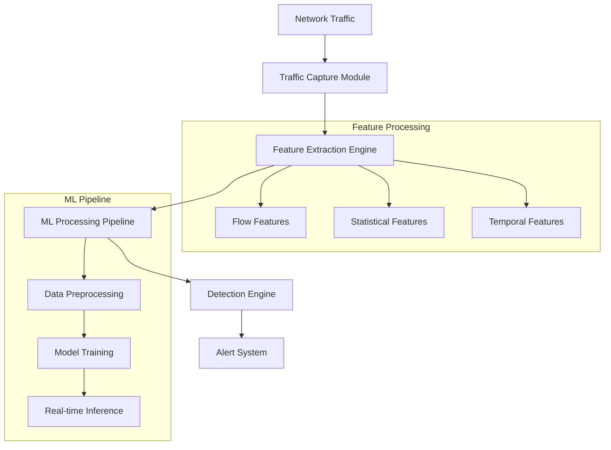
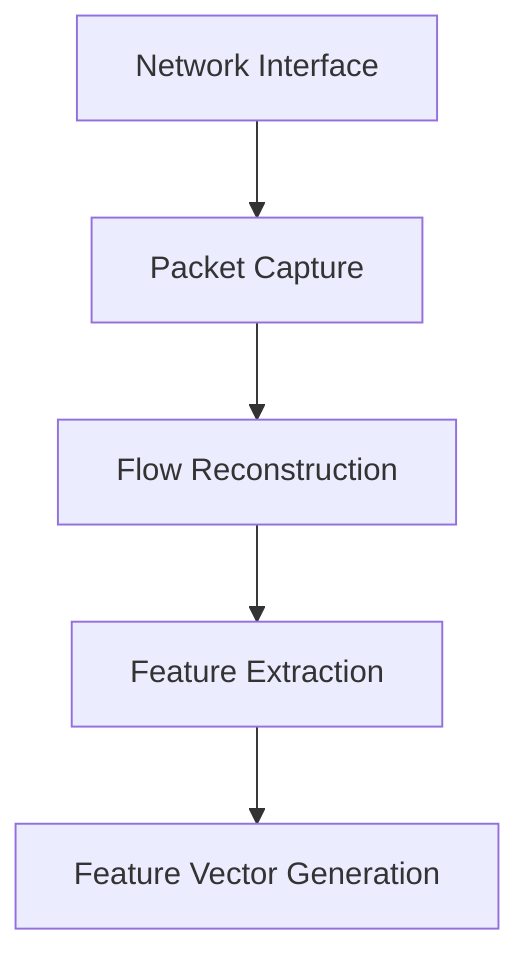
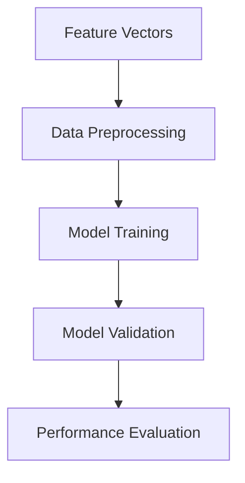

# Machine Learning-Based Intrusion Detection System for Encrypted Network Traffic

## Table of Contents

- [Problem Statement](#problem-statement)
- [Project Overview](#project-overview)
- [Technical Architecture](#technical-architecture)
- [Detailed Workflow](#detailed-workflow)
- [Implementation Strategy](#implementation-strategy)
- [Evaluation Framework](#evaluation-framework)

## Problem Statement

### Background

The exponential growth in encrypted network traffic poses significant challenges for traditional Intrusion Detection Systems (IDS). With over 80% of internet traffic being encrypted, conventional deep packet inspection methods are becoming ineffective. This necessitates innovative approaches that can detect malicious activities while respecting privacy and encryption protocols.

### Core Challenges

1. **Privacy-Preserving Detection**:

   - Must operate without decryption
   - Cannot compromise user privacy or security
   - Needs to maintain encryption integrity

2. **Real-Time Processing**:

   - Low latency requirements (<25ms)
   - High throughput demands (>1 Gbps)
   - Resource-efficient processing

3. **Detection Accuracy**:

   - Minimal false positives
   - High detection rate for unknown attacks
   - Robust against evasion techniques

4. **Scalability**:
   - Handle increasing network speeds
   - Support distributed deployment
   - Efficient resource utilization

### Project Scope

1. **Traffic Types**:

   - TLS/SSL encrypted flows
   - HTTPS traffic
   - VPN tunnels
   - General encrypted protocols

2. **Attack Categories**:

   - DDoS attacks
   - Malware communication
   - Data exfiltration
   - Protocol abuse
   - Zero-day attacks

3. **Feature Scope**:
   - Flow-based metadata
   - Statistical properties
   - Protocol characteristics
   - Temporal patterns

## Technical Architecture

### System Components



### Data Pipeline Architecture


## Detailed Workflow

### 1. Data Collection and Processing

- **Traffic Capture**:

  - High-speed packet capture
  - Flow reconstruction
  - Metadata extraction

- **Feature Engineering**:
  - Flow-level statistics
  - Packet-level features
  - Protocol metadata
  - Temporal characteristics



### 2. Model Development

#### Baseline Model

- **Architecture Selection**:

  - CNN for spatial features
  - LSTM for temporal patterns
  - XGBoost for classification
  - Hybrid approaches

- **Feature Processing**:
  - Normalization
  - Dimensionality reduction
  - Feature selection
  - Data augmentation



#### Advanced Models

- **Deep Learning Pipeline**:
  - GCN-LSTM hybrid
  - Attention mechanisms
  - Transfer learning
  - Ensemble methods

### 3. Real-Time Processing


## Implementation Strategy

### Phase 1: Foundation Setup

1. **Environment Configuration**

   - Development tools setup
   - Dataset preparation
   - Pipeline construction

2. **Baseline Implementation**
   - Feature extraction pipeline
   - Basic model architecture
   - Initial testing framework

### Phase 2: Core Development

1. **Model Implementation**

   - Advanced architecture development
   - Training pipeline setup
   - Optimization mechanisms

2. **Performance Enhancement**
   - Throughput optimization
   - Latency reduction
   - Resource optimization

### Phase 3: Advanced Features

1. **Scaling Implementation**

   - Distributed processing
   - Load balancing
   - Resource management

2. **System Integration**
   - Alert system integration
   - Monitoring setup
   - Deployment pipeline

## Evaluation Framework

### Performance Metrics

1. **Detection Metrics**:

   ```
   - Accuracy
   - Precision
   - Recall
   - F1-Score
   - AUC-ROC
   ```

2. **Operational Metrics**:

   ```
   - Processing Latency
   - Throughput
   - CPU/Memory Usage
   - Network Overhead
   ```

3. **Scaling Metrics**:
   ```
   - Linear Scaling Factor
   - Resource Efficiency
   - Communication Cost
   ```

### Comparative Analysis

- Baseline vs Advanced Models
- Different Architecture Comparisons
- Scaling Performance Analysis
- Resource Utilization Studies

### Visualization and Reporting

1. **Performance Visualizations**:

   - ROC Curves
   - Confusion Matrices
   - Performance Graphs

2. **Operational Visualizations**:

   - Latency Distribution
   - Throughput Analysis
   - Resource Usage Patterns

3. **Scaling Visualizations**:
   - Scaling Behavior
   - Resource Efficiency
   - System Bottlenecks

---

---

## Future Enhancements

1. **Advanced Detection**:

   - Zero-day attack detection
   - Adversarial attack resistance
   - Automated feature learning

2. **System Optimization**:

   - Hardware acceleration
   - Advanced caching
   - Distributed processing

3. **Integration Capabilities**:
   - SIEM integration
   - API development
   - Custom alerting mechanisms
