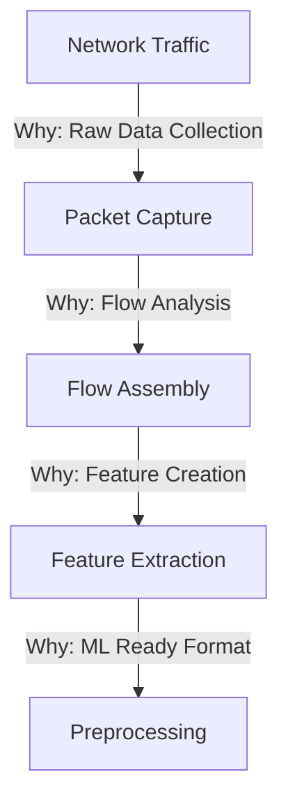
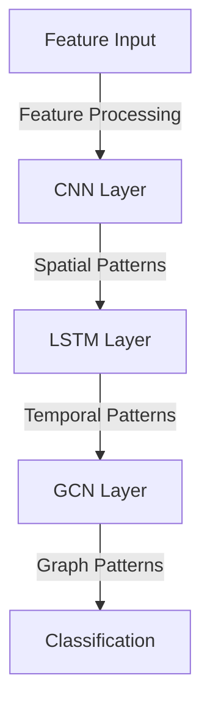
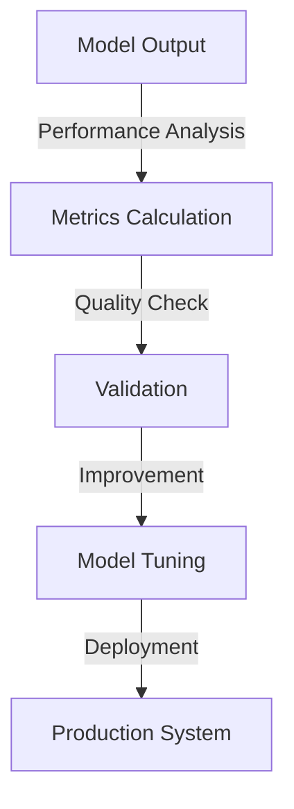

# Project Walkthrough: ML-Based IDS for Encrypted Traffic

## Why We Need This System

### Current Challenges in Network Security

1. **Encryption Prevalence**

   - Over 80% of internet traffic is now encrypted
   - Traditional IDS systems can't inspect encrypted packets
   - Privacy regulations require maintaining encryption

2. **Evolving Threats**

   - Sophisticated attacks hiding in encrypted traffic
   - Zero-day exploits increasing
   - Need for real-time detection

3. **Performance Requirements**
   - High-speed networks (10+ Gbps)
   - Low latency requirements
   - Resource efficiency needs

## Complete Workflow with Justifications

### 1. Traffic Capture & Preprocessing

**Why This Stage?**

- **Packet Capture**: Essential for real-time monitoring
- **Flow Assembly**: Provides context and patterns
- **Feature Extraction**: Enables ML without decryption
- **Preprocessing**: Ensures data quality for ML models

### 2. Feature Engineering Pipeline

**Why These Features?**

1. **Basic Features**

   - Packet lengths
   - Inter-arrival times
   - Protocol information
   - _Why?_ Fundamental traffic characteristics

2. **Temporal Features**

   - Time series patterns
   - Burst analysis
   - Sequential behaviors
   - _Why?_ Capture attack patterns over time

3. **Flow Features**
   - Connection patterns
   - Behavioral profiles
   - Protocol anomalies
   - _Why?_ Identify complex attack patterns

### 3. Model Architecture

**Why This Architecture?**

1. **CNN Component**

   - Spatial feature learning
   - Pattern recognition
   - _Why?_ Effective at local pattern detection

2. **LSTM Component**

   - Sequential pattern learning
   - Long-term dependencies
   - _Why?_ Captures temporal attack patterns

3. **GCN Component**
   - Network structure learning
   - Flow relationships
   - _Why?_ Models traffic relationships

### 4. Real-Time Processing Pipeline

**Why This Pipeline?**

1. **Stream Processing**

   - Handles continuous data
   - Minimal latency
   - _Why?_ Real-time detection needed

2. **Batching Strategy**

   - Optimizes processing
   - Balances resources
   - _Why?_ Efficient processing

3. **Real-time Inference**
   - Quick decisions
   - Resource efficient
   - _Why?_ Immediate threat detection

### 5. Evaluation System

**Why These Metrics?**

1. **Detection Metrics**

   - Accuracy, Precision, Recall
   - F1-Score, AUC-ROC
   - _Why?_ Measure detection effectiveness

2. **Operational Metrics**
   - Latency
   - Throughput
   - Resource usage
   - _Why?_ Ensure system efficiency

### 6. Deployment Strategy

**Why This Strategy?**

1. **Staged Deployment**

   - Controlled testing
   - Risk mitigation
   - _Why?_ Ensure reliability

2. **Continuous Monitoring**
   - Performance tracking
   - Resource optimization
   - _Why?_ Maintain effectiveness

## Implementation Priorities

### Phase 1: Foundation

1. **Data Pipeline** (Priority: High)

   - _Why?_ Essential for all later stages
   - _Impact:_ Enables feature extraction

2. **Basic Features** (Priority: High)
   - _Why?_ Core detection capabilities
   - _Impact:_ Initial model training

### Phase 2: Enhancement

1. **Advanced Features** (Priority: Medium)

   - _Why?_ Improves detection accuracy
   - _Impact:_ Better threat detection

2. **Model Optimization** (Priority: Medium)
   - _Why?_ Performance improvement
   - _Impact:_ Resource efficiency

### Phase 3: Production

1. **Scaling** (Priority: Medium)

   - _Why?_ Handle larger networks
   - _Impact:_ Production readiness

2. **Integration** (Priority: Low)
   - _Why?_ System connectivity
   - _Impact:_ Operational usage

## Success Criteria

### Technical Success

1. **Performance Targets**

   - Latency < 25ms
   - Throughput > 1 Gbps
   - Accuracy > 95%

2. **Operational Targets**
   - CPU usage < 60%
   - Memory efficiency
   - Scalable deployment

### Business Success

1. **Security Improvement**

   - Reduced false positives
   - Better threat detection
   - Faster response times

2. **Operational Efficiency**
   - Resource optimization
   - Cost-effective scaling
   - Easy maintenance

## Risk Mitigation

1. **Technical Risks**

   - Performance bottlenecks
   - Feature effectiveness
   - Model accuracy

2. **Operational Risks**
   - Resource constraints
   - Integration challenges
   - Scaling issues

## Monitoring and Maintenance

1. **Performance Monitoring**

   - Real-time metrics
   - Resource usage
   - Model effectiveness

2. **System Updates**
   - Model retraining
   - Feature updates
   - System optimization
