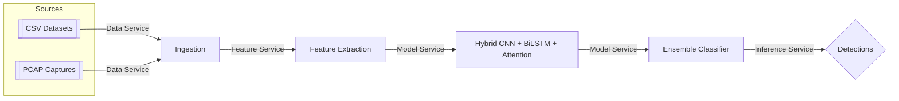
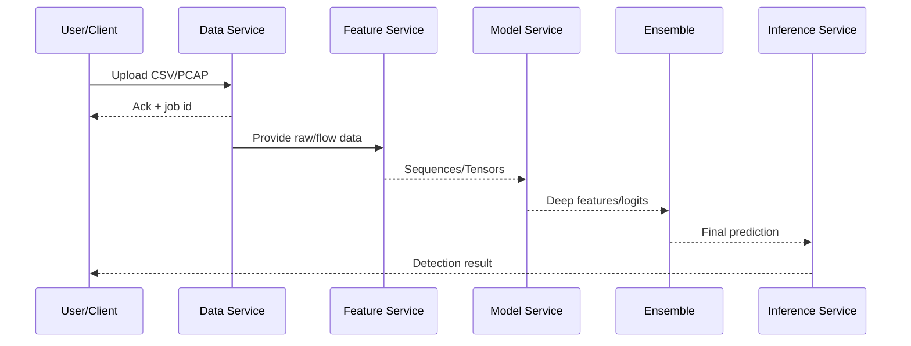

# P22: Encrypted Traffic Intrusion Detection System

## 🎯 Project Overview

**P22** is a comprehensive machine learning-based Intrusion Detection System (IDS) designed specifically for encrypted network traffic analysis. This project addresses critical challenges in modern cybersecurity through innovative feature engineering, hybrid detection frameworks, and adversarial robustness.

### 🔑 Key Objectives

1. **Feature Engineering Innovation**: Develop invariance-driven features for encrypted traffic
2. **Hybrid Detection Framework**: Implement CNN-LSTM ensemble architectures
3. **Adversarial Robustness**: Achieve ≥90% detection against evasion attacks
4. **Cross-Dataset Generalization**: Ensure model performance across different datasets
5. **Real-Time Processing**: Deploy scalable, production-ready IDS infrastructure

## 📁 Project Structure

### Core Components

| Directory           | Purpose                              | P22 Relevance                          |
| ------------------- | ------------------------------------ | -------------------------------------- |
| `01_Data/`          | Data management and preprocessing    | Feature Scarcity & Data Generalization |
| `02_Features/`      | Feature extraction and engineering   | Feature Engineering Innovation         |
| `03_Models/`        | Model architectures and training     | Hybrid Detection Framework             |
| `04_Source_Code/`   | Core application logic               | Real-Time Processing & Integration     |
| `05_Evaluation/`    | Performance testing and validation   | Adversarial Robustness & KPIs          |
| `06_Deployment/`    | Production deployment infrastructure | Scalability & Implementation           |
| `07_Documentation/` | Research and implementation guides   | Literature Analysis & Guidelines       |

### Detailed Structure

```
P22_Encrypted_Traffic_IDS/
├── 01_Data/
│   ├── 01_Raw/                    # Original datasets (NSL-KDD, UNSW-NB15, PCAPs)
│   ├── 02_Processed/              # Cleaned, normalized data
│   ├── 03_Synthetic/              # Adversarial traffic generation
│   └── 04_Metadata_Schemas/       # Data schema definitions
├── 02_Features/
│   ├── 01_Feature_Extraction_Scripts/  # Statistical feature extraction
│   ├── 02_Novel_Feature_Modules/       # Invariance-driven features
│   └── 03_Feature_Selection_Analysis/  # Feature importance analysis
├── 03_Models/
│   ├── 01_Architectures/          # CNN-LSTM hybrid models
│   ├── 02_Training_Scripts/       # Training pipelines
│   ├── 03_Trained_Weights/        # Model checkpoints
│   └── 04_Adversarial_Training/   # Adversarial robustness training
├── 04_Source_Code/
│   ├── core/                      # Utility functions
│   ├── pipeline/                  # MLOps orchestration
│   └── api/                       # Real-time API endpoints
├── 05_Evaluation/
│   ├── 01_Metrics_Calculators/    # KPI calculation scripts
│   ├── 02_Cross_Dataset_Testing/  # Generalization testing
│   ├── 03_Adversarial_Testing/    # Evasion attack testing
│   └── 04_Visualization_Scripts/  # Performance visualization
├── 06_Deployment/
│   ├── Docker/                    # Containerization
│   ├── Kubernetes/                # Orchestration manifests
│   └── Integration_Hooks/         # SIEM/Firewall integration
└── 07_Documentation/
    ├── Reports/                   # Project deliverables
    └── Paper_Analysis/            # Literature review
```

## 🚀 Quick Start

### Prerequisites

- Python 3.8+
- Docker & Kubernetes (for deployment)
- CUDA-capable GPU (recommended)

### Installation

```bash
# Clone and setup
cd P22_Encrypted_Traffic_IDS
python -m pip install -r requirements.txt

# (Optional) Verify GPU
python - << 'PY'
import torch; print('CUDA:', torch.cuda.is_available())
PY
```

## 🧭 End-to-End Execution Guide (Step-by-Step)

### 1) Architecture at a Glance



### 2) Run Microservices Locally (Development)

Open four terminals and run:

```bash
uvicorn 04_Source_Code.api.data_service:app --reload --port 8001
uvicorn 04_Source_Code.api.feature_service:app --reload --port 8002
uvicorn 04_Source_Code.api.model_service:app --reload --port 8003
uvicorn 04_Source_Code.api.inference_service:app --reload --port 8004
```

Health checks:

```bash
curl http://localhost:8001/health
curl http://localhost:8002/health
curl http://localhost:8003/health
curl http://localhost:8004/health
```

### 3) Data Ingestion

- CSV pathing is free-form; PCAP requires flow extraction first.

CSV quick check (Notebook):

```text
04_Source_Code/notebooks/01_CSV_Ingestion_and_Cleaning.ipynb
```

PCAP to flows using CICFlowMeter placeholder (Notebook):

```text
04_Source_Code/notebooks/02_PCAP_to_Flows_and_Processing.ipynb
```

CLI placeholder (saves CSV flow features when CICFlowMeter is wired):

```python
from services.data_ingestion.pcap_loader import pcap_to_flows_with_cicflowmeter
pcap_to_flows_with_cicflowmeter('01_Data/01_Raw/sample.pcap', output_csv='01_Data/02_Processed/flows.csv')
```

To wire CICFlowMeter, you can use the bundled binary under references or install it system-wide, then call it inside `pcap_loader.py`.

### 3b) Terminal-Only Interactive CLI

Run interactive wizard or explicit commands (no UI):

```bash
# Wizard (prompts for mode/file/params)
python 04_Source_Code/cli/p22.py wizard

# Or explicit subcommands
python 04_Source_Code/cli/p22.py preprocess --mode csv --path 01_Data/02_Processed/sample.csv
python 04_Source_Code/cli/p22.py preprocess --mode pcap --path 01_Data/01_Raw/sample.pcap
python 04_Source_Code/cli/p22.py model_demo --seq-len 100 --feat-dim 32 --num-classes 5
python 04_Source_Code/cli/p22.py adversarial_step --seq-len 100 --feat-dim 32 --num-classes 5 --epsilon 0.01
python 04_Source_Code/cli/p22.py ensemble_demo --feat-dim 128 --num-classes 5
```

### 4) Feature Learning and Model

- Attention-enhanced Hybrid CNN + BiLSTM:

```text
04_Source_Code/services/model_service/hybrid_attention_model.py
```

Try the demo Notebook:

```text
04_Source_Code/notebooks/03_Feature_Engineering_Attention.ipynb
```

### 5) Adversarial Training (Robustness)

- FGSM training utilities:

```text
04_Source_Code/services/adversarial_service/trainer.py
```

Notebook (single-step demo):

```text
04_Source_Code/notebooks/05_Adversarial_Training_and_Evaluation.ipynb
```

### 6) Ensemble Classification

- RandomForest-based final decision layer:

```text
04_Source_Code/services/ensemble_service/ensemble_classifier.py
```

Notebook:

```text
04_Source_Code/notebooks/06_Ensemble_Evaluation_and_ZeroDay.ipynb
```

### 7) Inference and API Usage

Example inference flow (conceptual):

1. Send CSV/PCAP to Data Service
2. Feature Service transforms sequences to model-ready tensors
3. Model Service generates deep features and logits
4. Ensemble makes the final prediction

Check health:

```bash
curl http://localhost:8004/health
```

Upload endpoints (examples for Data Service; wire your client accordingly):

```bash
# CSV upload (multipart/form-data)
curl -F "file=@path/to/dataset.csv" http://localhost:8001/ingest/csv

# PCAP upload (multipart/form-data)
curl -F "file=@path/to/capture.pcap" http://localhost:8001/ingest/pcap
```

### 8) Two Dataset Modes: CSV and PCAP

- CSV mode: Load and train directly from pre-processed CSVs.
- PCAP mode: Convert PCAP → flows (CSV features) → model pipeline.

Recommended file locations:

```
01_Data/
  01_Raw/           # .pcap, original CSVs
  02_Processed/     # flow CSVs generated from PCAP or cleaned CSVs
```

### 9) Notebooks Index

- 01_CSV_Ingestion_and_Cleaning.ipynb
- 02_PCAP_to_Flows_and_Processing.ipynb
- 03_Feature_Engineering_Attention.ipynb
- 04_Complete_End_to_End_Workflow.ipynb (existing)
- 05_Adversarial_Training_and_Evaluation.ipynb
- 06_Ensemble_Evaluation_and_ZeroDay.ipynb

## 🐳 Docker Deployment

Build the image:

```bash
cd 06_Deployment/Docker
docker compose build
```

Run core stack (API + Redis + monitoring):

```bash
docker compose up -d
```

Run optional profiles:

```bash
# Start trainer once
docker compose --profile training up p22-trainer

# Start batch processor
docker compose --profile batch up -d p22-batch
```

Environment variables (examples):

```
API_TOKEN=your-secure-api-token
GRAFANA_PASSWORD=admin123
```

After startup:

- API gateway (if configured via nginx): http://localhost/
- Core API direct: http://localhost:8000
- Redis: localhost:6379
- Prometheus: http://localhost:9090
- Grafana: http://localhost:3000
- Kibana: http://localhost:5601

## 🔄 Execution Flow Diagram (Detailed)



## 🧪 Evaluation & KPIs

Use `05_Evaluation/` scripts and the notebooks to compute metrics and visualize results. Adversarial robustness can be validated with the adversarial notebook and custom tests under `03_Adversarial_Testing/`.

## ⚙️ Troubleshooting

- If PCAP conversion returns a placeholder DataFrame, wire CICFlowMeter in `services/data_ingestion/pcap_loader.py` and ensure the binary is on PATH.
- Verify Python imports in notebooks run from the repository root (or add the root to `PYTHONPATH`).
- On Windows, prefer PowerShell for running `uvicorn` commands.

### Windows / Python 3.14 build errors (HDF5/tables/pyarrow)

- If you see errors like missing `H5public.h` or failing to build `tables`, use the minimal requirements file that avoids heavy HDF5/Arrow dependencies:

```powershell
python -m venv env
./env/Scripts/Activate.ps1
python -m pip install --upgrade pip
pip install -r requirements-minimal.txt
```

- Or use Python 3.10/3.11 where more prebuilt wheels are available.

### One-liner to set up and run ARFF combined training (PowerShell)

```powershell
./scripts/setup_and_run_arff.ps1 `
  -A1 "01_Data/Scenario A1-ARFF" `
  -A2 "01_Data/Scenario A2-ARFF" `
  -B  "01_Data/Scenario B-ARFF" `
  -Req "requirements-minimal.txt"
```

If running manually, note Click converts underscores to hyphens:

```powershell
python 04_Source_Code\cli\p22.py arff-combine-train `
  --a1 "01_Data/Scenario A1-ARFF" `
  --a2 "01_Data/Scenario A2-ARFF" `
  --b  "01_Data/Scenario B-ARFF"
```

## 📊 Key Performance Indicators (KPIs)

| Metric                 | Target | Current | Status |
| ---------------------- | ------ | ------- | ------ |
| Detection Rate         | ≥95%   | TBD     | 🔄     |
| False Positive Rate    | ≤2%    | TBD     | 🔄     |
| Adversarial Robustness | ≥90%   | TBD     | 🔄     |
| Cross-Dataset F1-Score | ≥85%   | TBD     | 🔄     |
| Real-time Latency      | ≤100ms | TBD     | 🔄     |

## 🔬 Research Contributions

### 1. Feature Engineering Innovation

- **TLS Handshake Entropy Analysis**: Novel features from encrypted handshake patterns
- **Temporal Flow Characteristics**: Time-invariant features for encrypted traffic
- **Metadata-Based Signatures**: Statistical patterns in packet timing and sizes

### 2. Hybrid Detection Framework

- **CNN-LSTM Architecture**: Spatial and temporal pattern recognition
- **Ensemble Methods**: Multi-model voting and stacking
- **Attention Mechanisms**: Focus on critical traffic segments

### 3. Adversarial Robustness

- **Adversarial Training**: Defense against evasion attacks
- **Robust Feature Selection**: Attack-resistant feature engineering
- **Uncertainty Quantification**: Confidence-aware predictions

## 🛡️ Security Features

### Threat Detection Capabilities

- **Malware Communication**: C&C channel detection
- **Data Exfiltration**: Encrypted tunnel analysis
- **APT Activities**: Advanced persistent threat identification
- **Zero-Day Attacks**: Anomaly-based detection

### Adversarial Defense

- **FGSM Resistance**: Fast Gradient Sign Method defense
- **PGD Robustness**: Projected Gradient Descent protection
- **C&W Attack Mitigation**: Carlini & Wagner attack defense

## 🔧 MLOps Pipeline

### Continuous Integration

```yaml
# .github/workflows/p22-ci.yml
- Data Validation
- Feature Engineering Tests
- Model Training Pipeline
- Performance Benchmarking
- Deployment Readiness
```

### Monitoring & Alerting

- **Model Drift Detection**: Performance degradation alerts
- **Data Quality Monitoring**: Input validation and anomaly detection
- **System Health Metrics**: API latency and throughput monitoring

## 📈 Scalability Architecture

### Horizontal Scaling

- **Kubernetes Deployment**: Auto-scaling based on traffic load
- **Load Balancing**: Distributed inference across multiple nodes
- **Caching Layer**: Redis-based feature and prediction caching

### Performance Optimization

- **Model Quantization**: Reduced precision for faster inference
- **Batch Processing**: Efficient bulk traffic analysis
- **GPU Acceleration**: CUDA-optimized model inference

## 🤝 Integration Guidelines

### SIEM Integration

```python
# Example SIEM connector
from p22_ids import ThreatDetector

detector = ThreatDetector()
threat_score = detector.analyze_traffic(network_flow)
siem_client.send_alert(threat_score, flow_metadata)
```

### Firewall Integration

```python
# Dynamic rule generation
if threat_score > threshold:
    firewall.block_ip(source_ip, duration=3600)
    firewall.add_rule(generate_blocking_rule(flow_pattern))
```

## 📚 Documentation

- **[Technical Architecture](07_Documentation/Reports/technical_architecture.md)**
- **[API Reference](07_Documentation/Reports/api_reference.md)**
- **[Deployment Guide](07_Documentation/Reports/deployment_guide.md)**
- **[Performance Benchmarks](07_Documentation/Reports/performance_benchmarks.md)**

## 🔬 Research Papers & Analysis

- **[Literature Review](07_Documentation/Paper_Analysis/literature_review.md)**
- **[Comparative Analysis](07_Documentation/Paper_Analysis/comparative_analysis.md)**
- **[Novel Contributions](07_Documentation/Paper_Analysis/novel_contributions.md)**

## 🏆 Project Milestones

### Phase 1: Foundation (Weeks 1-4)

- [x] Project structure setup
- [x] Data pipeline implementation
- [ ] Basic feature engineering
- [ ] Baseline model development

### Phase 2: Innovation (Weeks 5-8)

- [ ] Novel feature development
- [ ] Hybrid model architecture
- [ ] Adversarial training implementation
- [ ] Cross-dataset validation

### Phase 3: Optimization (Weeks 9-12)

- [ ] Performance optimization
- [ ] Scalability testing
- [ ] Production deployment
- [ ] Documentation completion

## 🤝 Contributing

1. **Feature Development**: Follow the feature engineering guidelines
2. **Model Contributions**: Implement new architectures in `03_Models/01_Architectures/`
3. **Testing**: Add comprehensive tests in respective evaluation modules
4. **Documentation**: Update relevant documentation for any changes

## 📄 License

This project is licensed under the MIT License - see the [LICENSE](LICENSE) file for details.

## 📞 Contact

- **Project Lead**: [Your Name](mailto:your.email@example.com)
- **Research Team**: [Team Email](mailto:team@p22-ids.com)
- **Issues**: [GitHub Issues](https://github.com/your-org/p22-encrypted-traffic-ids/issues)

---

**🔐 Securing the Future of Encrypted Network Traffic Analysis**
